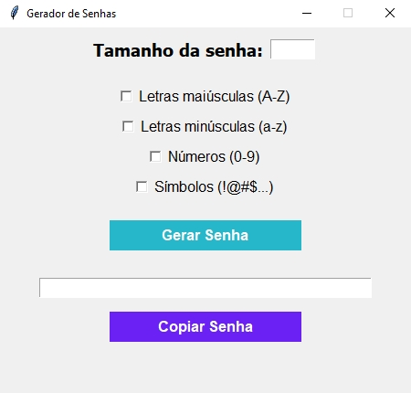

# 🔑 Gerador de Senhas em Python

Este é um **gerador de senhas** desenvolvido em **Python** com interface gráfica usando **Tkinter**.  
Ele permite criar senhas personalizadas de acordo com as opções escolhidas pelo usuário, avaliar a força da senha e copiá-la para a área de transferência com um clique.

---

## 🚀 Funcionalidades
- Definir o **tamanho da senha**.
- Escolher se a senha terá:
  - ✅ Letras maiúsculas (A-Z)  
  - ✅ Letras minúsculas (a-z)  
  - ✅ Números (0-9)  
  - ✅ Símbolos (!@#$...)  
- Exibição da **força da senha** (Fraca, Média ou Forte).
- Botão para **copiar senha para a área de transferência**.
- Interface simples e prática

---



---

## 🛠️ Tecnologias utilizadas
- **Python 3**
- **Tkinter** (interface gráfica)
- **Random** e **String** (para geração de senhas)

---

## 📂 Como executar o projeto
1. Clone este repositório:
   ```bash
   git clone https://github.com/GabrielPree/Gerador_de_Senhas.git

2. Acesse a pasta do projeto:
   ```bash
   cd Gerador_de_Senhas

3. Execute o arquivo Python:
   ```bash
    python gerador_senhas.py

---

## 📌 Aprendizados

- Prática com **Tkinter** (criação de janelas, frames, labels, entries e botões).

- Uso de **random.choice()** e **string** para gerar senhas.

- Manipulação da área de transferência no Tkinter.

- Aplicação de **hover** nos botões para deixar o design mais bonito.

---

## 📜 Licença

Este projeto é de **livre uso**. 🚀


